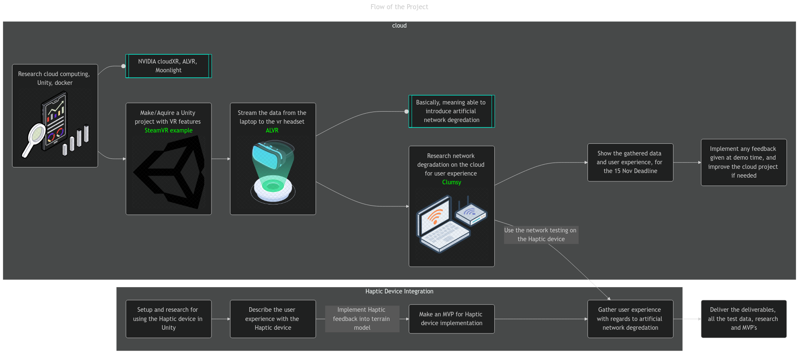

# Product Backlog

### Network Architecture Simulation

## Research-Oriented Product Backlog: Cloud VR Project

| **Requirement**                                  | **Description**                                                                                                      | **Tasks**                                                                                                                                     | Acceptence criteria | **MoSCoW**    |
| ------------------------------------------------ | -------------------------------------------------------------------------------------------------------------------- | --------------------------------------------------------------------------------------------------------------------------------------------- | ------------------- | ------------- |
| **Local Server Setup**                           | Configure a laptop to function as a local server for remote rendering, also just in the unity editor is also allowed | - Install necessary software for server (e.g., Unity, networking tools)   - Set up local server environment                                |   The 'game' is rendered on the laptop, as the 'game' does not stop when the VR headset is disconnected                  | Must          |
| **VR Application Development**                   | Create or modify a VR application to support remote rendering                                                        | - Develop Unity project with multiplayer capabilities   - Implement network synchronization for users                                      | The remote rendering from the game is visually available on the VR headset and interaction from the controllers and movement give feedback to the server so it can render a different scnere                    | Must          |
| **Use an actual VR headset for the application** | Make sure that an actual VR headset is used for the application, for now focus will lie on the quest 3               | - Aquire a quest 3 to work with                                                                                                               |                     | Must          |
| **Remote Rendering Implementation**              | Ensure that rendering is handled on the server while users connect remotely                                          | - Set up server-side rendering using Unity   - Test remote streaming to VR headsets                                                        |                     | Must          |
| **Network Degradation Simulation**               | Implement a tool to simulate various network conditions on the local server                                          | - Create scripts to simulate latency, packet loss, and bandwidth changes   - Test tool effectiveness                                       |                     | Must          |
| **Performance Data Logging**                     | Collect and log performance metrics during VR sessions (latency, frame rate, user feedback)                          | - Implement some kind of data logging   - Store logs locally for analysis                                                                  |                     | Must          |
| **Data Analysis**                                | Analyze collected data to understand the effects of network degradation on user experience                           | - Process and visualize performance data   - Summarize findings related to user feedback                                                   |                     | Must          |
| **MVP Creation for Stakeholders**                | Build a minimal viable product (MVP) showcasing remote rendering and network functionality                           | - Implement core features needed for MVP   - Ensure stability and performance for demonstration                                            |                     | Must (should) |
| **Iterate Based on Feedback**                    | Implement improvements based on user feedback from demo and testing sessions                                         | - Refine VR app and network simulation features   - Re-test with improved functionalities                                                  |                     | Could         |
| **Multiplayer Feature Implementation**           | Implement a multiplayer feature, such that it can be tested for synchronisation issues                               | - Develop and integrate multiplayer features in the VR application   - Validate synchronization of actions                                 |                     | Should        |
| **Test with Diverse User Groups**                | Conduct tests with various participants (family, friends, students, teachers)                                        | - Prepare recruitment strategies for testers   - Provide clear instructions for testing sessions                                           |                     | Should        |
| **Allow the usage for different vr headsets**    | Except for only a quest 3, make sure other VR headsets can be used aswell                                            | - Aquire different VR headsets   - Do research about the differences between the different VR headsets, based on the API                   |                     | Could         |
| **Usage of a dedicated server**                  | Use a dedicated server instead of rendering on a laptop                                                              | - Do research about the different options (AWS, Azure, etc)                                                                                   |                     | Could         |
| **Users can connect from all over the world**    | Users can connect to the remote server, via a vpn tunnel or some kind of secure network                              | - Figure out what type of connection to use   - Test the connections from different locations   - Gather data about the realistic setup |                     | Could         |

| **Requirement**                         | **Description** | **Tasks** | Acceptence criteria | **MoSCoW** |
| --------------------------------------- | --------------- | --------- | ------------------- | ---------- |
| VR headset usage             | Use a vr headset                |           |                     |            |
| Remote rendering (laptop)               |                 |           |                     |            |
| Network degredation                     |                 |           |                     |            |
| Collect data (metrics, user experience) |                 |           |                     |            |
| Analyse the data                        |                 |           |                     |            |

