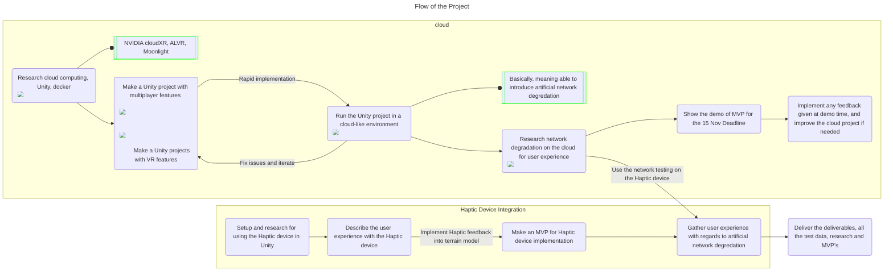

# Product Backlog

### Network Architecture Simulation

| Part             | Description                                                                                          | Tasks                                                                                                                |
| ---------------- | ---------------------------------------------------------------------------------------------------- | -------------------------------------------------------------------------------------------------------------------- |
| Setup idea       | Define the concept and framework for network architecture simulation                                 | - Research   - Document findings                                                                                  |
| Implement idea   | Develop the network simulation focusing on cloud-based architecture and network degradation effects  | - Learn Unity for implementation   - Experiment with a laptop as a server   - Integrate cloud-based simulation |
| Network test     | Test the network architecture under different conditions of latency and bandwidth limitations        | - Simulate network degradations   - Run performance tests   - Analyze system performance (latency, bandwidth)  |
| **MVP Creation** | Build a minimal viable product (MVP) showcasing basic functionality of cloud-based architecture      | - Implement basic cloud-based network with haptic feedback   - Ensure minimal functionality for presentation      |
| Demo of idea     | Present a working demo showcasing the MVP, including network effects and haptic feedback integration | - Prepare and present demo to stakeholders                                                                           |

### Haptic Interface Implementation in XR Environment

| Part            | Description                                                                    | Tasks                                                                                                          |
| --------------- | ------------------------------------------------------------------------------ | -------------------------------------------------------------------------------------------------------------- |
| Setup           | Define and configure the haptic devices for XR environment                     | - Research suitable haptic devices (e.g., Sense Glove, Ultraleap)   - Setup Unity with XR support           |
| User experience | Investigate the user experience with haptic feedback in the XR environment     | - Test haptic feedback on different XR elements (e.g., terrain elevation) depending on the haptic device       |
| Network test    | Test how network degradation affects the haptic feedback in the XR environment | - Simulate network delays and bandwidth limitations   - Measure impact on user experience (visual & haptic) |

### Final MVP
| Part             | Description                                                                                                                                     | Tasks                                                                                                           |
| ---------------- | ----------------------------------------------------------------------------------------------------------------------------------------------- | --------------------------------------------------------------------------------------------------------------- |
| **MVP Creation** | Build a minimal viable product (MVP) for the haptic interface in the XR environment, where the user can **see** and **touch** the terrain model | - Integrate haptic feedback with cloud-based architecture   - Ensure minimal functionality for demo purposes |
| Demo of idea     | Present a demo showcasing the MVP, including haptic feedback and the terrain model                                                              | - Prepare demo   - Present findings to stakeholders                                                          |

