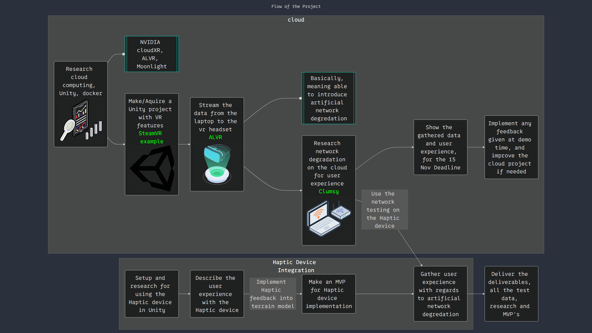

# Product Backlog

### Network Architecture Simulation

## Research-Oriented Product Backlog: Cloud VR Project

| **Requirement**                        | **Description**                                                                             | **Tasks**                                                                                                      | **MoSCoW** |
| -------------------------------------- | ------------------------------------------------------------------------------------------- | -------------------------------------------------------------------------------------------------------------- | ---------- |
| **Local Server Setup**                 | Configure your laptop to function as a local server for remote rendering                    | - Install necessary software for server (e.g., Unity, networking tools)   - Set up local server environment | Must       |
| **VR Application Development**         | Create or modify a VR application to support remote rendering and multiplayer features      | - Develop Unity project with multiplayer capabilities   - Implement network synchronization for users       | Must       |
| **Remote Rendering Implementation**    | Ensure that rendering is handled on the server while users connect remotely                 | - Set up server-side rendering using Unity   - Test remote streaming to VR headsets                         | Must       |
| **Network Degradation Simulation**     | Implement a tool to simulate various network conditions on the local server                 | - Create scripts to simulate latency, packet loss, and bandwidth changes   - Test tool effectiveness        | Must       |
| **Performance Data Logging**           | Collect and log performance metrics during VR sessions (latency, frame rate, user feedback) | - Implement some kind of data logging   - Store logs locally for analysis                                   | Must       |
| **Data Analysis**                      | Analyze collected data to understand the effects of network degradation on user experience  | - Process and visualize performance data   - Summarize findings related to user feedback                    | Must       |
| **MVP Creation for Stakeholders**      | Build a minimal viable product (MVP) showcasing remote rendering and network functionality  | - Implement core features needed for MVP   - Ensure stability and performance for demonstration             | Must       |
| **Iterate Based on Feedback**          | Implement improvements based on user feedback from demo and testing sessions                | - Refine VR app and network simulation features   - Re-test with improved functionalities                   | Could      |
| **Multiplayer Feature Implementation** | Implement a multiplayer feature, such that it can be tested for synchronisation issues      | - Develop and integrate multiplayer features in the VR application   - Validate synchronization of actions  | Should     |
| **Test with Diverse User Groups**      | Conduct tests with various participants (family, friends, students, teachers)               | - Prepare recruitment strategies for testers   - Provide clear instructions for testing sessions            | Should     |

